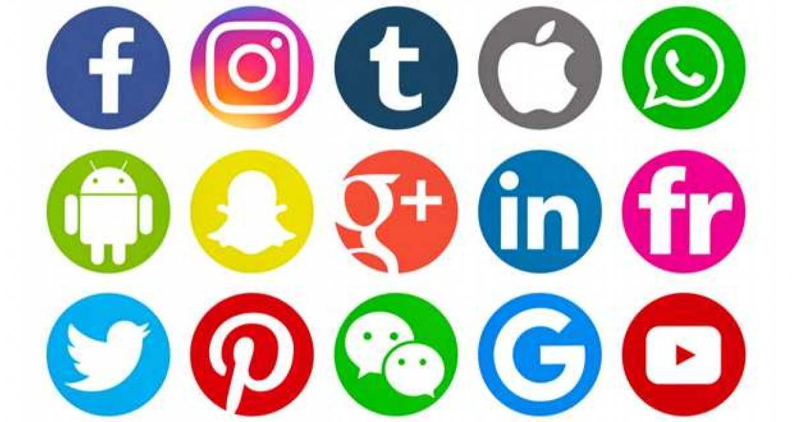

```{r setup, include=FALSE}
knitr::opts_chunk$set(echo = TRUE)
```

```{r library, include=FALSE} 
knitr::opts_chunk$set(echo = TRUE) 
#ajouter toute les library nécessaires
library(ade4)
library(FactoMineR)
library(bookdown)
library(knitr)
library(tibble)
library(tinytex)
```

```{r logo, echo=FALSE, out.width = '70%', fig.align = "center",fig.cap="Les réseaux sociaux"}
 #afficher l'image de markdown, doit être dans le même dossier
```

# **Définition**

<span style='color:red'> Nous pouvons lire sur [ce site](<https://business.lesechos.fr/directions-numeriques/digital/social-media/0301007159501-les-reseaux-sociaux-sont-ils-encore-sociaux-316885.php>) qu'un réseau social</span> a pour objectif de mettre en relation les internautes entre eux afin de créer des communautés ».
C’est une des catégories des médias sociaux mais il a vraiment pour objectif de créer des interactions entre plusieurs personnes.

<span style='color:red'>Un média social</span> est basé sur la communication. Il permet de publier des contenus et de générer de l’engagement pour que les internautes parlent de vous.Au départ un média social se définit comme étant un support pour transmettre de l’information massivement. Ce qu’il ne faut pas oublier dans le média social, c’est que chaque utilisateur peut recevoir l’information mais également la créer

# **L'utilisation des réseaux sociaux**

## ***Tableau de données***

```{r DataReseau, echo = FALSE, eval =TRUE}

DataReseau <- read.csv2(file = "ReseauxSociaux.csv",header=TRUE,sep=";", dec=".", row.names=1) #,encoding="latin1")# on import en créant l'objet
datatibble <- as_tibble(DataReseau)
knitTab1 <- knitr::kable(DataReseau[,1:2],caption="Pourcentage de connexion aux réseaux sociaux par rapport à l'utilisation d'internet",align = "c")
knitTab1
```


## ***Graphique***

```{r datareg, echo = FALSE,eval=TRUE}

med<-apply(DataReseau,1,mean)
par(mar=c(4,14,3,1))
barplot(sort(med), horiz=TRUE, las=1, main = "Moyenne par région française d'utilisation des réseaux sociaux", cex.main =1)
```


# **Interprétation**

Le jeu de donné contient **`r nrow(DataReseau)`** régions françaises. Le rapport entre le nombre de connexion à un réseau social et le nombre de connexion à internet équivaut en moyenne entre 2018 et 2019 en France à : **`r round(mean(DataReseau[1,1],DataReseau[1,2]))`**. Actuellement, la région la plus consommatrice de réseaux sociaux est : **`r names(med[med==max(med)])`**. Celle au contraire qui utilise le moins les réseaux sociaux par rapport à son nombre de connexion internet est : **`r names(med[med==min(med)])`**

# **Reflexion sociologique**


Les amis de mes amis tendent-ils à devenir mes amis!? Autrement dit, si nous
observons une communauté d’individus tels que des étudiants qui se trouvent amenés à
se côtoyer dans une université ou un internat, doit-on penser que les relations
affinitaires qui vont s’instaurer dans le groupe vont tendre à devenir transitives ou pas!?
Les jeunes vont-ils se grouper en fonction de similitudes (même sexe, fumeur ou non
fumeur, centres d’intérêt communs)!? Dans le même esprit, si l’on observe une
communauté à un instant donné et que l’on postule que les relations que l’on y voit
constituent une situation de croisière résultant d’un processus déjà ancien, quelles
hypothèses peut-on faire sur ce processus![@Degenne2004réseaux]

# **Les dangers des réseaux sociaux**

Après lecture [du site](https://www.ionos.fr/digitalguide/web-marketing/les-media-sociaux/dangers-reseaux-sociaux/) sur les médias sociaux, nous comprenons que l’utilisation naïve des réseaux sociaux peut engendrer des conséquences émotionnelles, financières mais aussi juridiques et mener, dans certains cas, à la divulgation ou propagation de vos données personnelles. Les enfants et adolescents courent déjà un risque sur les réseaux sociaux, mais les adultes, les pouvoir publics, les banques et même les grandes entreprises Web ne sont pas à l’abri des risques.

# **Références**

## ***Liens***
<https://mooc.chatons.org/mod/lesson/view.php?id=36&pageid=6&startlastseen=yes>

<https://business.lesechos.fr/directions-numeriques/digital/social-media/0301007159501-les-reseaux-sociaux-sont-ils-encore-sociaux-316885.php>

<https://www.ionos.fr/digitalguide/web-marketing/les-media-sociaux/dangers-reseaux-sociaux/>

https://appsso.eurostat.ec.europa.eu/nui/submitViewTableAction.do

## ***Bibliographie***

