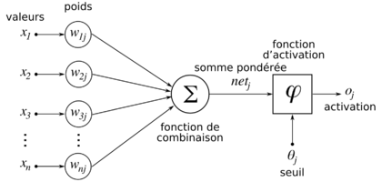

```{r logo, echo=FALSE, out.width = '70%', fig.align = "center",fig.cap="Structure d'un neurone artificiel"}

```

# **Généralités : nos essais**

* Domaines choisis pour la reconnaissance d'images : les animaux 

* Catégories pour les images à classer : lion et rhinocéros

* Remarques sur la constitution du corpus d'apprentissage:
    Deux sous dossiers ont été crées via le script python dataset_slipper.py, intitulés training-set et test-set. Le premier sert pour l'apprentissage, et le second pour le contrôle de l'apprentissage. 
    Pour cela, il était nécessaire de créer un dossier raw-set dans dataset, car sinon, aucun changement n'était remarqué. Cette première phase permet donc de trier dans un premier temps les images dans les deux sous dossiers. 
    
* Remarques sur la création du réseau neuronal (son utilisation, sa performance):
    Le réseau neuronal se base sur le code simple_cnn.py. Ce dernier gère le réseau neuronal avec les différentes classes. Ensuite, le code ajoute les couches du réseau neuronal. 
    Toutes les couches sont connectées entre elles. On appelle cela une multicouche. Seuls les derniers neurones que l'on trie arrivent en sortie. Ce programme permet donc d'analyser les images, de les trier et de tester statistiquement la fiabilité du triage à l'aide de passes  (5 passes, 10 passes... 25 passes). Plus il y a de passes requises, plus le temps d'exécution par l'ordinateur est important car la récurrence de l'action demandée a augmenté.
    
* Voici quelques exemples de sortie que l'on obtient lors du lancement du programme simple_cnn.py, ces résultats dépendent de la répartition des images dans test_set et training_set que dataset_splitter a réalisé :
    
  * **5p** :
  CNN  binary  ( 2 catégories)
  rhinoceros  :  2 / 20 ( 10 %)
  lion  :  0 / 20 ( 0 %)
  Global :  2 / 40 ( 5 %)


  * **10p** :
CNN  binary  ( 2 catégories)
rhinoceros  :  2 / 20 ( 10 %)
lion  :  1 / 20 ( 5 %)
Global :  3 / 40 ( 7 %)


  * **15p** :
CNN  binary  ( 2 catégories)
rhinoceros  :  3 / 20 ( 15 %)
lion  :  2 / 20 ( 10 %)
Global :  5 / 40 ( 12 %)

  * **25p** :
CNN  binary  ( 2 catégories)
rhinoceros  :  1 / 20 ( 5 %)
lion  :  2 / 20 ( 10 %)
Global :  3 / 40 ( 7 %)
    

```{r setup, include=FALSE}
knitr::opts_chunk$set(echo = TRUE)
```

```{r library, include=FALSE} 
knitr::opts_chunk$set(echo = TRUE) 
#ajouter toute les library nécessaires
library(ade4)
library(FactoMineR)
library(bookdown)
library(knitr)
library(tibble)
library(tinytex)
```
# **Étude des réseaux précédemment crées**
## *Tableau*

```{r DataReseau, echo = FALSE, eval =TRUE}

DataReseau <- read.csv2(file = "models.csv",header=TRUE,sep=",", dec=".") #,encoding="latin1")# on import en créant l'objet
datatibble <- as_tibble(DataReseau)
knitTab1 <- knitr::kable(DataReseau[8:12,3:8],caption="Pourcentage de réussite par rapport au nombre d'images de test")
knitTab1
```

Ce tableau montre les données qui seront utilisées pour le graphique 1. En effet, on peut voir que la seule donnée qui varie est le nombre de passes. Le nombres d'images pour l'apprentissage et le contrôle sont identiques.

## *Graphiques et interprétation*

```{r datareg, echo = FALSE,eval=TRUE}
reussite <- unlist(DataReseau[8:13,8])
passes <- unlist(DataReseau[8:13,5])
par(mar=c(4,14,3,1))
barplot(reussite~passes, las=1, main = "Pourcentage de réussite selon le nombre de passes", cex.main =1,xlab = "nombre de passes",ylab="% de réussite")
```

Grâce à ce graphique 1, on peut observer que le pourcentage de réussite dépend du nombre de passes réalisées. Le maximum est obtenu aux alentours des 15 passes avec une augmention de 3 à 15 puis une diminution. 
La premier principe est que plus le réseau est entrainé à reconnaître des rhinocéros ou des lions plus il pourra les identifier ensuite. En effet, à chaque entrainement il minimise les erreurs par rapport au dossier de contôle (test_set) en corrigeant les biais et les poids du réseau neuronal.
Cependant, lorsque le nombre de récurrences est trop important, il y a une dimition de la flexibilité du réseau neuronale. Les images de lion/rhinocéros étant légèrement différentes de celles présentent dans test_set sont catégorisées comme ne correspondant pas à l'animal choisi (différence de luminosité, de couleur de poils,...). De simples variations sur les images de lion/rhinocéros ne permettront au réseau neuronal de les identifier comme tel.

```{r dataimagetraining, echo = FALSE,eval=TRUE}
nb_imagetraining <- unlist(DataReseau[,4])
reussite <- unlist(DataReseau[,8])
par(mar=c(4,14,3,1))
plot(reussite~nb_imagetraining, las=1, main = "% de réussite selon le nombre d'images training", cex.main =1,xlab = "nombre d'images dans training",ylab="% de réussite")
```

Grâce à ce graphique 2, on peut observer d'une part que si on augmente de manière importante le nombre d'images dans training (693 à 1589), le poucentage de réussite augmente drastiquement (10% -> 65%). En effet, plus il y a d'images pour s'entrainer plus le réseau neuronal peut minimiser les biais et les poids de chaque neurone.
Cependant, ce n'est pas le seul facteur qui influence le poucentage de réussite. En effet, l'autre élément à remarquer est la composition des images en entrée. Pour le dossier cat_dog (65% de réussite en moyenne), il n'y a que deux types d'animaux. Pour le dossier savane50 (55% de réussite en moyenne), il y a 8 types d'animaux à reconnaître. Par conséquent, il est plus facile au réseau neuronal de donner la bonne réponse dans un système binaire.
Il reste également a expliqué la différence du taux de réussite entre savane50 (55% de réussite en moyenne) et savane100 (10% de réussite en moyenne). La seule différence est le nombre d'images collectées avant leur répartition dans training_set et test_set. Lors de la récupération des images, l'ordinateur fait apparaître les photos dans l'ordre de pertinence. Le second code va ensuite envoyer des images au hazard dans training_set. Nous supposons donc que savane100 contient moins d'images pertinentes à notre requête que savane50. Par conséquent, il y aura moins de ressemble entre les différentes images dans training_set. Il sera donc plus difficile pour le réseau neuronal d'établir des correspondances entre les images et le type d'animal. 
Il faut également ajouter la notion de "boîte noire" à ces explications. En effet, nous connaissons les imputs et les outputs mais nous ne savons pas ce qu'il se passe réellement dans les différentes couches du réseau neuronal.


# **Remarques**

## *Louise*

Cet exercice met en application le deep learning et nous comprenons l'intérêt du réseau neuronal. Cependant, je n'ai pas pu tester personnellement le code simple_cnn.py car je fais partie des 12 élèves  n'ayant pas pu installer correctement le package tensorflow. De ce fait, la compréhension du deep learning a été plus compliquée.

## *Zélie*
Avec cette mise en application, j'ai pu appréhender la notion de reconnaissance d'images.En effet, j'ai pu comprendre pourquoi en tant qu'utilisateur, il nous était demandé de reconnaitre des images de "passages piétons" ou de "feux tricolores". J'ai également remarqué que les traducteur avait progresser depuis ces dernières années et les avancés du deep learning en sont une raison.
Le bémol de cet exercice est le fait d'avoir un système d'exploitation MacOS différent de celui utilisé par le professeur. Ceci complique l'utilisation des différents scripts notamment avec le besoin d'installer la fonction pillow ou encore le fait d'avoir des documents invisibles crées par ce système d'exploitation. Par conséquent, j'ai perdu beaucoup de temps et je me suis remise en cause sur mes capacités à comprendre ce qui m'était demandé. Cependant, Monsieur Berteletti a été très réactif sur mes différents problèmes malgré le grand nombre d'élèves que nous sommes.
